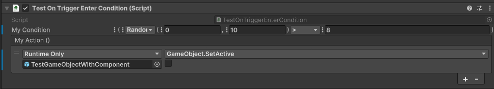

<h1 align="center">  
 
 Unity Inspector Expressions

 


</h1>

<small align="center">

a simple inspector extension to create flexible expressions.

</small>

<p align="center">
  <a href="#about">About</a> •
  <a href="#installation">Installation</a> •
  <a href="#features">Features</a> •
  <a href="#documentation">Documentation</a> •
</p>

# About

This originates from a SoA usage in mind. often you find yourself in the need to adjust a Variable stored in a SoA Asset. E.g. "This Value times 2".

This Package itself is not a SoA, but it provides a set of custom drawers to create expression logic for most common types.

There is also an inteded way to make it work with (hopefully) any SoA architecture out there.

# Installation

using Unity Package Manager:

add a package to 

```
git@github.com:soraphis/UnityInspectorExpressions.git
```

# Features

A set of custom drawers to create expression logic for most common types.


# Documentation

// TODO, add Tutorials to:
- [Simple Usage Example](Documentation~/SimpleUsage.md)
- Add Custom Expression Types
- Add Support to your favorite SoA package
- Rewrite Drawers using UIToolkit to have layouting more responsive
