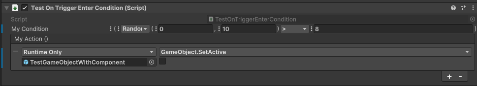

<h1 align="center">  
 
 Unity Inspector Expressions

 


</h1>

<small align="center">

a simple inspector extension to create flexible expressions.

</small>

<p align="center">
  <a href="#about">About</a> •
  <a href="#installation">Installation</a> •
  <a href="#features">Features</a> •
  <a href="#documentation">Documentation</a> •
</p>

# About

This originates from a SoA usage in mind. often you find yourself in the need to adjust a Variable stored in a SoA Asset. E.g. "This Value times 2".

This Package itself is not a SoA, but it provides a set of custom drawers to create expression logic for most common types.

There is also an inteded way to make it work with (hopefully) any SoA architecture out there.

# Installation

using Unity Package Manager:

add a package to 

```
https://github.com/soraphis/UnityInspectorExpressions.git
```

# Features

A set of custom drawers to create expression logic for most common types.

# Using a Context

Expressions are generic over a `TCtx` type parameter, which represents the context passed to `Evaluate(ctx)`. You can use any type as a context — a plain struct, a class, or a ScriptableObject.

To use **FromContext** expressions (e.g. `FromContextFloatExpression`), the context type must:

1. Be annotated with [`[GeneratePropertyBag]`](https://docs.unity3d.com/Packages/com.unity.properties@2.0/manual/index.html) (from `Unity.Properties`).
2. Expose properties with the `[CreateProperty]` attribute so they are accessible via `PropertyContainer`.

Example:

```csharp
using Unity.Properties;

[GeneratePropertyBag]
public class MyContext
{
    [CreateProperty] public float Speed { get; set; }
    [CreateProperty] public int Health { get; set; }
}
```

You can then set a `FromContextFloatExpression`'s path to `"Speed"` and it will read `ctx.Speed` at runtime via `PropertyContainer.GetValue`.

# TODO

- Tutorials to:
  - [Simple Usage Example](Documentation~/SimpleUsage.md)
  - Add Custom Expression Types
  - Add Support to your favorite SoA package
